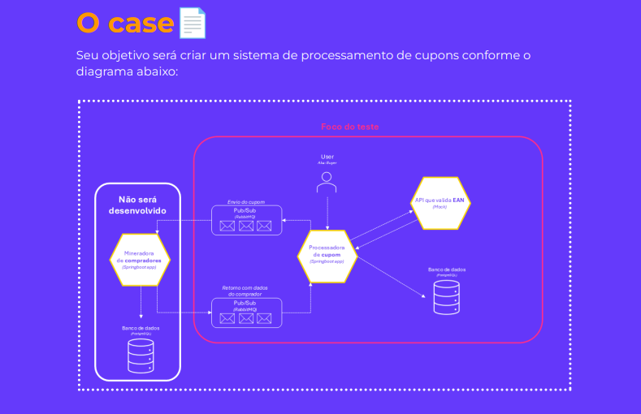

# Cupom System



## Descrição do Projeto:

O `Cupom System` é uma aplicação desenvolvida em Java 17 usando Spring Boot. O sistema processa cupons de compras, valida os dados dos produtos, grava as informações em um banco de dados PostgreSQL e utiliza RabbitMQ para integração e comunicação assíncrona com outros sistemas.

### Funcionalidades:

1. **Validação dos dados do cupom**:
   - Valida o código `code44` para garantir que ele possui 44 caracteres numéricos.
   - Valida o `companyDocument` para garantir que é um CNPJ válido.
   - Verifica se o `totalValue` corresponde à soma dos valores dos produtos.

2. **Validação dos produtos**:
   - Verifica se `ean` dos produtos são únicos.
   - Verifica se `unitaryPrice` dos produtos são positivos.
   - Verifica se `quantity` dos produtos não são negativos.

3. **Persistência dos dados**:
   - Salva os dados do cupom em um banco de dados PostgreSQL.

4. **Publicação de cupons válidos**:
   - Publica os cupons válidos em uma fila RabbitMQ.

5. **Listener para RabbitMQ**:
   - Recebe informações adicionais de compradores através do RabbitMQ e atualiza os cupons no banco de dados.

## Tecnologias Utilizadas:

- **Java 17**: Linguagem de programação principal.
- **Spring Boot**: Framework para construção de aplicações Java.
- **Maven**: Gerenciador de dependências e construção de projeto.
- **PostgreSQL**: Banco de dados relacional para armazenamento de dados de cupons.
- **RabbitMQ**: Sistema de mensageria para comunicação assíncrona.
- **Docker**: Containerização da aplicação e serviços.
- **Postman**: Ferramenta para testes de API.

## Pré-requisitos:

- Docker e Docker Compose instalados
- Postman (para testes de API)

## Configuração e Execução:

### 1. Clonar o repositório

```bash
   git clone https://github.com/digonexs/java-back-end-developer-test-HUB.git
   
   cd java-back-end-developer-test-HUB
```
### 2. Construir e rodar os containers:
- Execute o comando abaixo para construir as imagens e iniciar os containers. O --build força a construção das imagens, garantindo que qualquer alteração no `Dockerfile` ou no código seja refletida.

```bash
   docker-compose up --build
```
- Este comando fará o seguinte:

- Construir as imagens: Usará o Dockerfile para construir a imagem da aplicação Spring Boot.
- Subir os serviços: Inicializará os serviços definidos no `docker-compose.yml`, incluindo o PostgreSQL, RabbitMQ e a aplicação Spring Boot.

### 3. Testes
- Para executar os testes unitários, use o comando abaixo:

```bash
  ./mvnw test
```

### 4. Testes de API com Postman
- Uma coleção do Postman é fornecida para facilitar os testes da API. Importe a coleção no Postman e execute as requisições para testar a criação de cupons, consulta de cupons, criação de produtos, consulta de produtos e mais.

### Desenvolvido por: [Rodrigo](https://www.linkedin.com/in/rodrigocavalcantedebarros/)